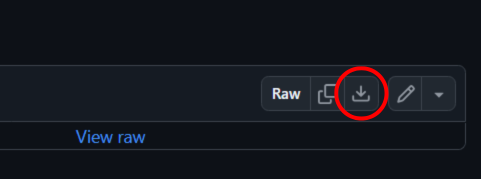
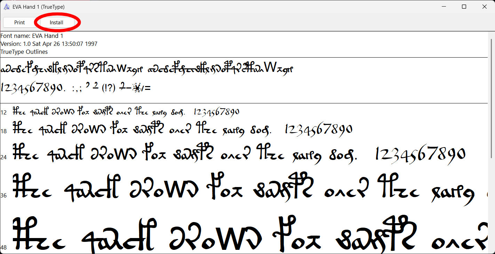
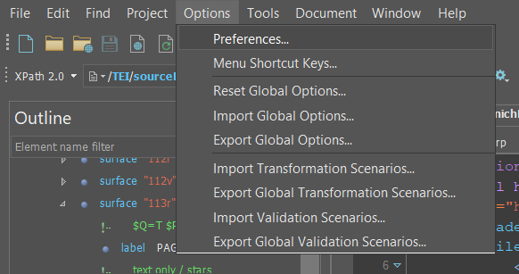
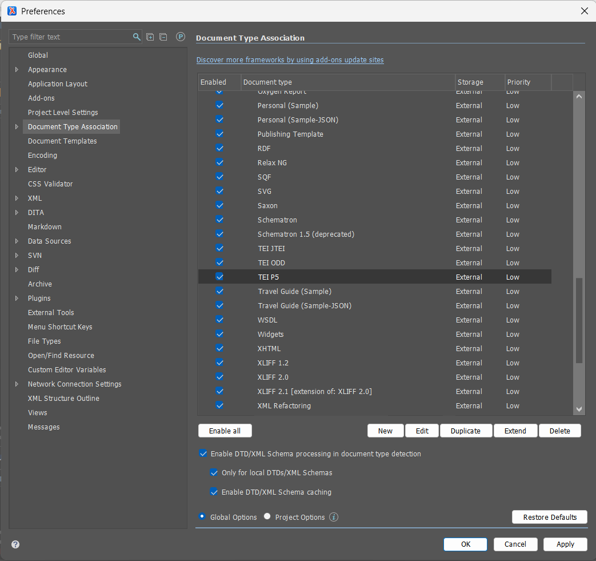
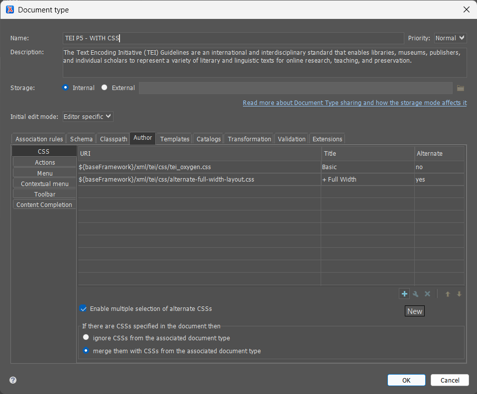
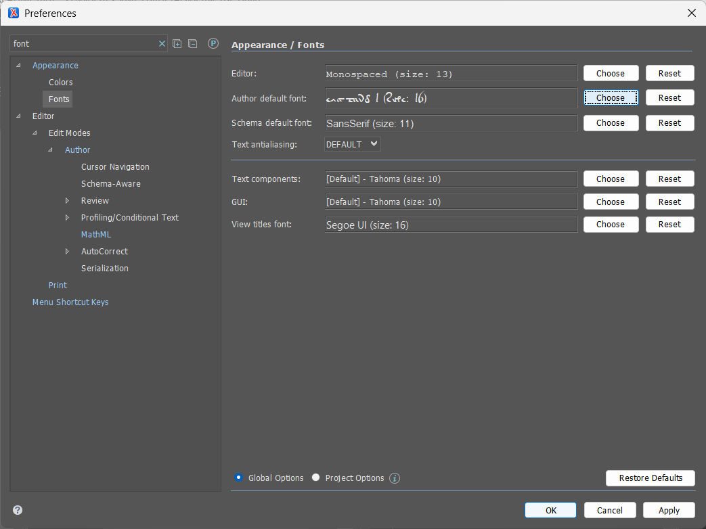
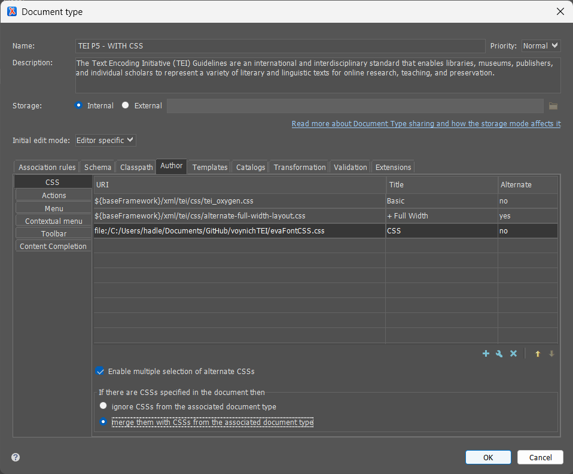
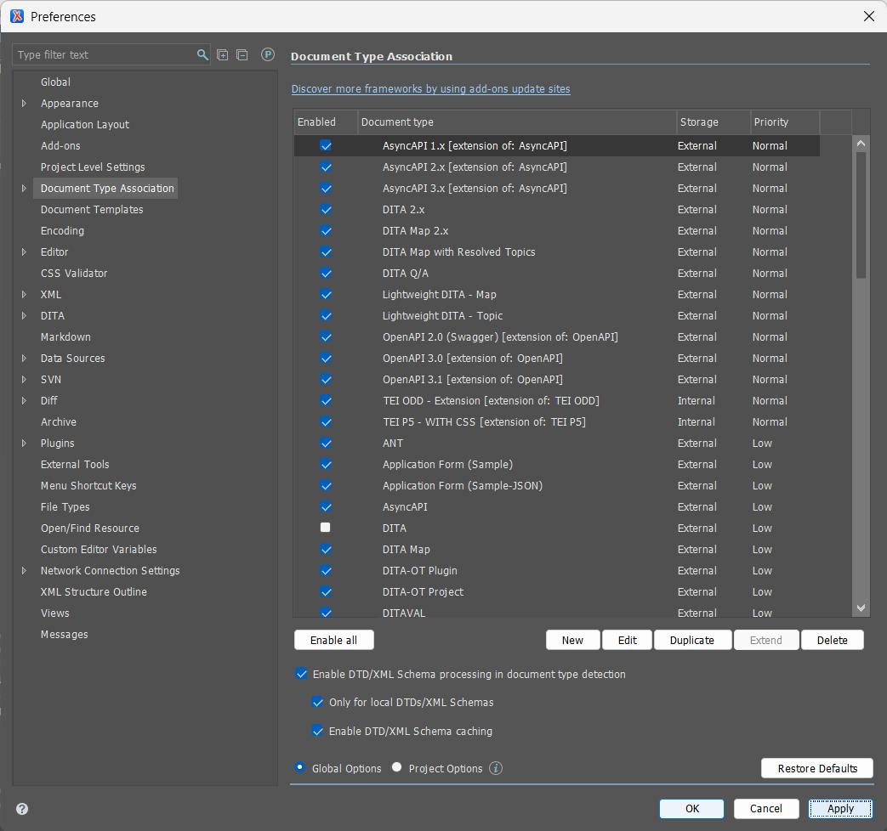
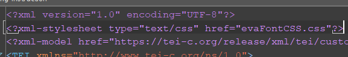
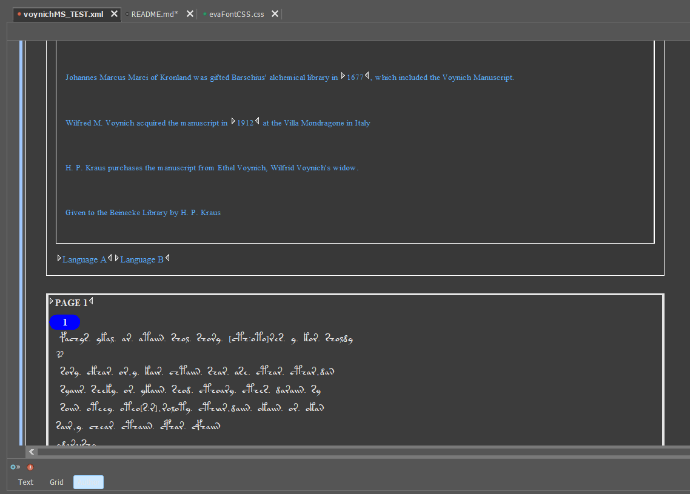

# 🌿 Voynich TEI

A TEI analysis of the Voynich Manuscript
---
---
---
## EVA Font in Oxygen
1. Go to the repo and grab the `EVA2.tff` file and the `evaFontCSS.css` file
1. Download the RAW file for both and put them in the same repo (Or simply clone the repo)
   * 
1. Click on the `eva1.tff` file and click `Install`
   * 
1. Go to Oxygen and go to Options -> Preferences
   * 
1. Look up `Document Type Association` and double click `TEI P5` under `Document Type`. Make sure it is enabled as well
   * 
1. This step creates a new document type. Name it whatever you want. Go to the Author Tab. Then, go to the plus sign and click it
   * 
1. Look for the `evaFontCSS.css` file in your documents. Title it whatever you'd like. Then click `OK`
   * 
1. Click `OK`
   * 
1. Click `Apply` and then `OK`
   * 
1. Add `<?xml-stylesheet type="text/css" href="evaFontCSS.css"?>` to the top portion of your document like so
   * 
1. You're done! Your Author Mode should now look like this, with everything within the `<line>` element now being in Voynichese and everything else in English!
   * 

---

## Instructions
### Step 1: Gather Files
Clone this repo onto your computer by doing the following:
```
git clone https://github.com/newtfire/voynichTEI.git
```

### Step 2: Downloads
This is a list of programs I used in order to complete this project:
1. [OxygenXML Editor](https://www.oxygenxml.com/xml_editor/download_oxygenxml_editor.html?os=Windows)
1. [PyCharm](https://www.jetbrains.com/pycharm/?source=google&medium=cpc&campaign=amer_en_us_est_pycharm_branded&term=pycharm&content=785237935139&gad_source=1&gad_campaignid=14127625430&gclid=CjwKCAjw687NBhB4EiwAQ645dpuecQzEsyA8-SytU0ErWbuCJxzVifV3OwpJaoTVVxdhp3a2vymErRoCLCwQAvD_BwE)
1. [Markup Blitz Windows](https://github.com/newtfire/textAnalysis-Hub/blob/main/Installations/ixml-xproc-InstallNotes-Win.md#markup-blitz)
1. [Markup Blitz Mac](https://github.com/newtfire/textAnalysis-Hub/blob/main/Installations/ixml-xproc-InstallNotes-Mac.md#markup-blitz)

### Step 2.5: Python
NOTE: This step is only if you plan to use the entire ZL3b-n.txt document and not just the herbal section. If you are only using the herbal section, feel free to skip this, as the herbal.txt file already did this for you!

In PyCharm, create a VoynichTEI project, and open replaceAscii.py (Located [here](https://github.com/newtfire/voynichTEI/tree/main/python) inside the python directory).

Run the file, and you should now have a ZL3b-n_updated.txt file (Located [here](https://github.com/newtfire/voynichTEI/tree/main/ixml) inside the ixml directory).

## Step 3: Invisible XML
Go into your Bash shell and go to the VoynichTEI directory

To get an output on the entire ZL3b-n document, in your shell, type the following:
```
blitz ixml/translit.ixml transliterationFiles/ZL3b-n_updated.txt > xml/outputXML.xml
```
If you just want the herbal section instead, type the following:
```
blitz ixml/translitHerbal.ixml transliterationFiles/herbal.txt > xml/outputXMLherbal.xml
```
This sends the text documents through the invisible xml file and makes it into an XML file!

## Step 4: XSLT
Now we need to send the output XML file through an XSLT file. You will need OxygenXML to do this.

In Oxygen, open your outputXML.xml file and the ixmlOut-to-TEI.xsl document (Located [here](https://github.com/newtfire/voynichTEI/tree/main/xslt) in the xslt directory).

Switch to the XSLT Debugger Perspective, which is located at the top right of the screen:


In the top left corner, put `outputXML.xml` or `outputXMLherbal.xml` in the XML input, and `ixmlOut-to-TEI.xsl` in the XSL input like so:


When you are ready, put the filepath to where you would like your output file saved. Here, I just wrote outputTEI.xml as an example:


Press the run button:


Now you have it as a proper TEI file!

---

## Layout of the Manuscript
* Quire 1


* Quire 2


* Quire 3


* Quire 4


* Quire 5


* Quire 6


* Quire 7


* Quire 8


* Quire 9


* Quire 10


* Quire 11


* Quire 12


* Quire 13


* Quire 14


* Quire 15


* Quire 17


* Quire 19


* Quire 20


---

## 📄 Transliteration Files

### ZL3b-n

- The latest release of the Zandbergen-Landini transliteration of 1999 in the IVTFF 2.0 format. 
- It is a complete transliteration, including all 5389 loci that have been identified in the MS. It uses the Eva alphabet, including the high-ascii extensions.
- The file has been corrected in numerous places. Some parts of the text inside folds of the pages still need to be added.

### RF1b-e

- The first stable version of a reference transliteration, which was created automatically as a combination of the GC and ZL transliterations, in the IVTFF 2.0 format. 
- The original file was defined using the STA alphabet, and the present file is a simplification/approximation using Basic, not-capitalised Eva.

---

## 🔗 References

* Beinecke Library high-res images of the Voynich manuscript
  * [https://collections.library.yale.edu/catalog/2002046](https://collections.library.yale.edu/catalog/2002046)
* Transliteration files directory
  * [https://www.voynich.nu/data/](https://www.voynich.nu/data/)
* Layout of the Manuscript images
  * [https://www.voynich.nu/layout.html](https://www.voynich.nu/layout.html)
* Voynich Manuscript Website
  * [https://www.voynich.nu/](https://www.voynich.nu/)


