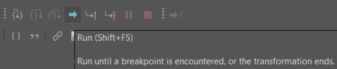

<header>
    <h1>{{ title }}</h1>
</header>

    <h1>Step 1: Gather Files</h1>
    
Gather the files necessary for this project. To do this, clone my repo by typing the following in your terminal:

    <pre><code>git clone https://github.com/newtfire/voynichTEI.git</code></pre>

    <h1>Step 2: Downloads</h1>
    
This is a list of things I used in order to complete this project.

    <ul>
        <li><a href="https://www.oxygenxml.com/xml_editor/download_oxygenxml_editor.html?os=Windows">OxygenXML Editor</a></li>
        <li><a href="https://github.com/newtfire/textAnalysis-Hub/blob/main/Installations/ixml-xproc-InstallNotes-Win.md">Windows Installations</a> - Scroll to Markup Blitz and download that</li>
        <li><a href="https://github.com/newtfire/textAnalysis-Hub/blob/main/Installations/ixml-xproc-InstallNotes-Mac.md">Mac Installations</a> - Scroll to Markup Blitz and download that</li>
    </ul>

    <h1>Step 3: Python</h1>
    
NOTE: This step is only if you plan to use the entire ZL3b-n.txt document and not just the herbal section. If you are only using the herbal section, feel free to skip this, as the herbal.txt file already did this for you!

    
Make sure that you can run python in your terminal.

    
In your terminal, go into your <a href="https://github.com/newtfire/voynichTEI/tree/main/python">python</a> folder:

    <pre><code>cd python</code></pre>
    
Run the <a href="https://github.com/newtfire/voynichTEI/tree/main/python">replaceAscii.py</a> file by typing the following:

    <pre><code>python replaceAscii.py</code></pre>
    
You should now have <a href="https://github.com/newtfire/voynichTEI/blob/main/transliterationFiles/ZL3b-n_updated.txt">ZL3b-n_updated.txt</a> inside the <a href="https://github.com/newtfire/voynichTEI/tree/main/transliterationFiles">transliterationFiles</a> directory.

    <h1>Step 4: Invisible XML</h1>
    
Next we send the transliteration file through an Invisible XML grammar called <a href="https://github.com/newtfire/voynichTEI/blob/main/ixml/translit.ixml">translit.ixml</a>.

    
To do this, in your terminal, go out of your python directory and back into the voynichTEI directory:

    <pre><code>cd ..</code></pre>
    
Then, use Markup-Blitz to create an XML file:

    <pre><code>blitz ixml/translit.ixml transliterationFiles/ZL3b-n_updated.txt > xml/outputXML.xml</code></pre>
    
If you just want the herbal section instead, type the following:

    <pre><code>blitz ixml/translitHerbal.ixml transliterationFiles/herbal.txt > xml/outputXMLherbal.xml</code></pre>
    
You should now have <a href="https://github.com/newtfire/voynichTEI/blob/main/xml/outputXML.xml">outputXML.xml</a> or <a href="https://github.com/newtfire/voynichTEI/blob/main/xml/outputXMLherbal.xml">outputXMLherbal</a> in the <a href="https://github.com/newtfire/voynichTEI/tree/main/xml">xml</a> directory.

    <h1>Step 5: XSLT</h1>
    
Now we need to send the output XML file through an XSLT file. You will need OxygenXML to do this.

    
In Oxygen, open your output file and <a href="https://github.com/newtfire/voynichTEI/tree/main/xslt">ixmlOut-to-TEI.xsl</a> document in the <a href="https://github.com/newtfire/voynichTEI/tree/main/xslt">xslt</a> directory.

    
Switch to the XSLT Debugger Perspective, which is located at the top right of the screen:

    
    
In the top left corner, put <code>outputXML.xml</code> or <code>outputXMLherbal.xml</code> in the XML input, and <code>ixmlOut-to-TEI.xsl</code> in the XSL input like so:

    
    
When you are ready, put the filepath to where you would like your output file saved. In voynichTEI, this would be inside the <a href="https://github.com/newtfire/voynichTEI/tree/main/tei">tei</a> directory:

    
    
Press the run button:

    
    
Now you have it as a proper TEI file!

