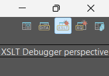

<header>
    <h1>{{ title }}</h1>
</header>

    <h1>Step 1: Gather Files</h1>
    
Gather the files necessary for this project. All of these can be found on my <a href="https://github.com/newtfire/voynichTEI">GitHub Repo</a>, but if you would like to manually download them from their original source, feel free to do so below.

    <ul>
        <li><a href="https://www.voynich.nu/data/ZL3b-n.txt">ZL3b-n.txt</a> - A complete transliteration of the Voynich Manuscript in IVTFF 2.0 format.</li>
        <li><a href="https://raw.githubusercontent.com/newtfire/voynichTEI/refs/heads/main/ixml/herbal.txt">herbal.txt</a> - Just the herbal section of the Transliteration</li>
        <li><a href="https://www.voynich.nu/Fonts/EVA2.ttf">EVA2.tff</a> - Extensible Voynich Alphabet font</li>
        <li><a href="https://raw.githubusercontent.com/newtfire/voynichTEI/refs/heads/main/python/replaceAscii.py">replaceAscii.py</a> - Replaces the ascii with unicode characters (you may need to change the file names depending on where you put your files for this to work)</li>
        <li><a href="https://raw.githubusercontent.com/newtfire/voynichTEI/refs/heads/main/ixml/translit.ixml">translit.ixml</a> - An Invisible XML file that makes the IVTFF file into XML</li>
        <li><a href="https://raw.githubusercontent.com/newtfire/voynichTEI/refs/heads/main/ixml/translitHerbal.ixml">translitHerbal.ixml</a> - An Invisible XML file for just the herbal section (herbal.txt)</li>
        <li><a href="https://raw.githubusercontent.com/newtfire/voynichTEI/refs/heads/main/xslt/ixmlOut-to-TEI.xsl">ixmlOut-to-TEI.xsl</a> - XSLT to transform herbal XML into proper TEI</li>
    </ul>

    <h1>Step 2: Downloads</h1>
    
This is a list of things I used in order to complete this project.

    <ul>
        <li><a href="https://www.oxygenxml.com/xml_editor/download_oxygenxml_editor.html?os=Windows">OxygenXML Editor</a></li>
        <li><a href="https://www.jetbrains.com/pycharm/?source=google&medium=cpc&campaign=amer_en_us_est_pycharm_branded&term=pycharm&content=785237935139&gad_source=1&gad_campaignid=14127625430&gclid=CjwKCAjw687NBhB4EiwAQ645dpuecQzEsyA8-SytU0ErWbuCJxzVifV3OwpJaoTVVxdhp3a2vymErRoCLCwQAvD_BwE">PyCharm</a></li>
        <li><a href="https://github.com/newtfire/textAnalysis-Hub/blob/main/Installations/ixml-xproc-InstallNotes-Win.md">Windows Installations</a> - Scroll to Markup Blitz and download that</li>
        <li><a href="https://github.com/newtfire/textAnalysis-Hub/blob/main/Installations/ixml-xproc-InstallNotes-Mac.md">Mac Installations</a> - Scroll to Markup Blitz and download that</li>
    </ul>

    <h1>Step 2.5: Python</h1>
    
NOTE: This step is only if you plan to use the entire ZL3b-n.txt document and not just the herbal section. If you are only using the herbal section, feel free to skip this, as the herbal.txt file already did this for you!

    
In PyCharm, create a VoynichTEI project if using the VoynichTEI from GitHub, and open replaceAscii.py (located inside the Python directory if using VoynichTEI).

    
If you are not using the VoynichTEI from GitHub, you may need to change the input and output filenames.

    
Run the file, and you should now have a ZL3b-n_updated.txt file!

    <h1>Step 3: Invisible XML</h1>
    
Once you've downloaded the files, OxygenXML Editor, and the installations, go into your Bash shell and go to the VoynichTEI directory (or wherever you downloaded your files)

    
If you are using the VoynichTEI directory, type <code>cd ixml</code> to go into the ixml directory.

    
To get an output on the entire ZL3b-n document, in your shell, type the following:

    <pre><code>blitz translit.ixml ZL3b-n_updated.txt > outputXML.xml</code></pre>
    
If you just want the herbal section instead, type the following:

    <pre><code>blitz translitHerbal.ixml herbal.txt > outputXML.xml</code></pre>
    
This sends the text documents through the invisible xml file and makes it into an XML file!

    <h1>Step 4: XSLT</h1>
    
Now we need to send the output XML file through an XSLT file. You will need OxygenXML to do this.

    
Open your outputXML.xml file and the ixmlOut-to-TEI.xsl document in Oxygen.

    
Switch to the XSLT Debugger Perspective, which is located at the top right of the screen:

    
    
In the top left corner, put <code>outputXML.xml</code> in the XML input, and <code>ixmlOut-to-TEI.xsl</code> in the XSL input like so:

    
    
When you are ready, put the filepath to where you would like your output file saved. Here, I just wrote <code>outputTEI.xml</code> as an example:

    

